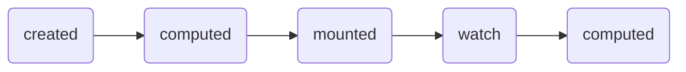

# 生命周期

### 1、实现透明变化

```vue
<template>
	<h2 :style="{opacity}">欢迎来这里</h2>
</template>
<script>
	new Vue({
        data() {
            opacity: 1
        }
    })
    
    //通过外部定时器实现（不推荐）
    setInterval(() => {
        vm.opacity -= 0.01
        if(vm.opacity <= 0) vm.opacity = 1
    },16)
</script>
```

```vue
<template>
	<h2 :style="{opacity}">欢迎来这里</h2>
	<button @click="stop">点我停止</button>
</template>
<script>
	new Vue({
        data() {
            opacity: 1
        },
        methods() {  //方法
        	stop() {
                clearInterval(this.timer)
            }
        },
        mounted() {
        	this.timer = setInterval(() => {
            	this.opacity -= 0.01
            	if(this.opacity <= 0) this.opacity = 1
            })
        }
    })
</script>
```

### ##、生命周期

|       方法        |                             作用                             |
| :---------------: | :----------------------------------------------------------: |
| beforeCreate（）  |     在初始化（生命周期、事件）之后，此时数据代理还未开始     |
|    Created（）    | 在数据监测、数据代理之后调用，可以访问到data中的数据和methods方法 |
|    methods（）    |              作为事件的回调，如点击、鼠标滑过等              |
|  beforeMount（）  | 此时页面呈现的是未经VUE编译的DOM结构，所有对DOM的操作，不奏效 |
|    mounted（）    |  VUE完成模板的解析并把真实DOM元素放入页面后（挂载完毕）调用  |
| beforeUpdate（）  |                此时数据是最新的，但页面是旧的                |
|    updated（）    |                                                              |
|   $destroy（）    | 完全销毁一个实例，清理它与其它实例的连接，解绑它的全部指令及自定义事件监听器 |
| beforeDestroy（） | 此时，实例中的data、methods等都处于可用状态，马上要执行销毁过程，一般在此阶段：关闭定时器、取消订阅消息、解绑自定义事件等 |
|   destroyed（）   |                           销毁完毕                           |

### ##、生命周期执行顺序（常见的）



